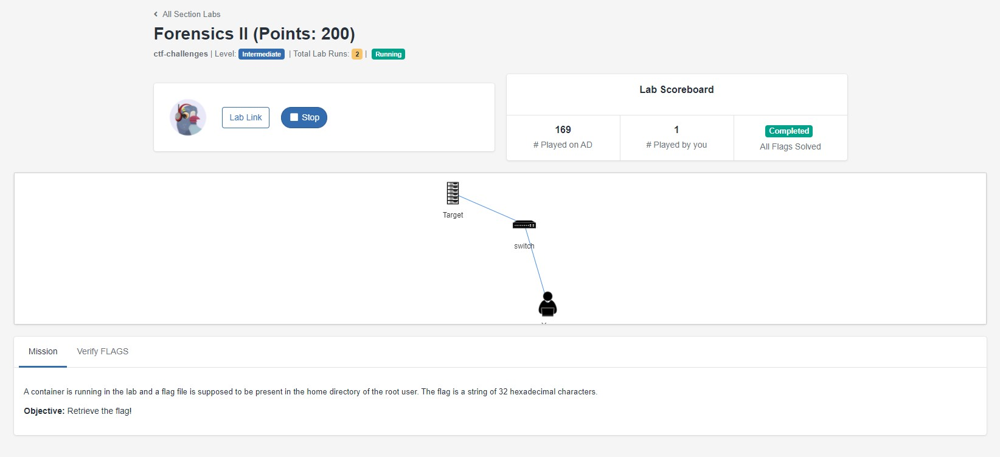

# CySummit 2021 Forensics 2

We are given a remote server with bash access. Volatility is not provided.



## Step 1:

Since volatility is not provided and the question gave a hint that a container is running in the lab, we can quickly guess that `Docker` is involved.

Quickly running `docker ps` shows us that the following container is running:

```bash
CONTAINER ID        IMAGE               COMMAND               CREATED             STATUS              PORTS               NAMES
977f098934b3        ubuntuderived       "tail -f /dev/null"   12 minutes ago      Up 12 minutes                           mod-ubuntu
```

The question had also said that the flag is present in the root directory, so doing a quick `docker exec` should allow us to retrieve the file. We first check the presence of the file `flag`.

```bash
$ docker exec 977f097934b3 ls
> flag
```

Indeed, we see that there is a file called flag that is in the root of the docker container. We can try to cat the file for the flag!

```bash
$ docker exec 977f098934b3 cat flag
> Overwritten
```

Or so we thought.... The file's contents has been overwritten, so we are kind of stuck here.

## Step 2

Going off a seperate tangent, we know that docker containers are built using docker images, so we can try to find the image that was used to build this container.

```bash
$ docker image ls
> REPOSITORY          TAG                 IMAGE ID            CREATED             SIZE
> ubuntuderived       latest              1b0b3bfeee1b        18 months ago       65.3MB
> ubuntu              18.04               775349758637        20 months ago       64.2MB
```

We can see that `ubuntuderived` is the image that was used to build the container.
We can use `docker history` to see how the image was built.

```bash
$ docker history 1b0b3bfeee1b
>
IMAGE               CREATED             CREATED BY                                      SIZE                COMMENT
1b0b3bfeee1b        18 months ago       /bin/sh -c chmod +x /bin/bash                   1.11MB
<missing>           18 months ago       /bin/sh -c echo "Overwritten" > /root/flag      12B
<missing>           18 months ago       /bin/sh -c #(nop) WORKDIR /root                 0B
<missing>           18 months ago       /bin/sh -c md5sum /bin/bash > /root/flag        44B
<missing>           20 months ago       /bin/sh -c #(nop)  CMD ["/bin/bash"]            0B
<missing>           20 months ago       /bin/sh -c mkdir -p /run/systemd && echo 'do…   7B
<missing>           20 months ago       /bin/sh -c set -xe   && echo '#!/bin/sh' > /…   745B
<missing>           20 months ago       /bin/sh -c [ -z "$(apt-get indextargets)" ]     987kB
<missing>           20 months ago       /bin/sh -c #(nop) ADD file:a48a5dc1b9dbfc632…   63.2MB
student@localhost:~$
```

We get the above information, and we can see that a file was added in the first line of the build. The `md5sum` of the folder /bin/bash was written to the file `flag`, then overwritten with `Overwritten`. We can try to retrieve then try to retrieve this `md5sum`.

## Step 3

We can use `docker cp` to copy out files from the container to our workspace to access `bin/bash` since Docker does not allow us to `exec` commands outside of the build context.

We run the following:

```bash
docker cp 977f098934b3:. .
$ ls
> bin  boot  dev  etc  home  lib  lib64  media  mnt  opt  proc  root  run  sbin  srv  sys  tmp  usr  var
```

We have successfully copied out the OS files from the container.

Now all we have to do is run `md5sum` on the directory `/bin/bash` to retrieve the hash.

```bash
$ md5sum /bin/bash
> 5b62133afdcb9e96015f8679888f4434  /bin/bash
```

And our flag is `5b62133afdcb9e96015f8679888f4434`.
